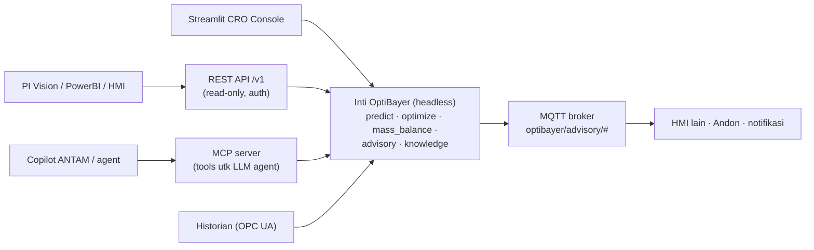

# 07 — Integrasi ke Sistem Pabrik (Referensi Masa Depan)

> Ringkasan panjang ada di doc 06 Bagian 8–9. Dokumen ini = catatan teknis integrasi
> yang bisa dibuka lagi saat pitch/juri bertanya, atau saat proyek lanjut pasca-hackathon.

## Arsitektur integrasi target

```
DCS pabrik (Yokogawa / Honeywell / ABB)          [Purdue Level 1–2]
   │  OPC UA (akun READ-ONLY)
   ▼
Plant Historian (OSIsoft PI / AVEVA / TimescaleDB)  [Level 3]
   │  connector + validasi kualitas data (range check, stale check)
   ▼
AI RED MUD engine  ← LAPIS 1–3 kita, TIDAK berubah   [Level 3.5 / DMZ]
   │  REST API internal + dashboard web
   ▼
CRO console (browser)  +  LIMS (hasil lab = ground truth retraining)
```

Kalimat kunci: **satu-satunya komponen yang diganti dari demo adalah Lapis 0** —
replay dicabut, connector historian dicolok. Lapis model/fisika/optimizer/advisory utuh.

## Roadmap 3 fase

| Fase | Durasi | Isi | Risiko ke pabrik |
|---|---|---|---|
| 1. Shadow mode | 0–3 bln | Baca historian, tampilkan advisory, TIDAK mengendalikan; akurasi dibanding hasil lab | Nol (read-only) |
| 2. Advisory resmi | 3–9 bln | Soft sensor causticity tervalidasi vs LIMS; setpoint dipakai CRO dengan approval supervisor; KPI penghematan diukur | Rendah (human-in-the-loop) |
| 3. Closed-loop / APC | 9+ bln | Setpoint ditulis balik ke DCS dalam amplop aman | Perlu MOC & validasi formal |

## Checklist komponen tambahan untuk produksi (JANGAN dibangun saat hackathon)

- [ ] Connector OPC UA / PI Web API + buffer lokal saat jaringan putus
- [ ] Validasi data masuk: range fisik, sensor freeze/stale, missing → jangan umpan model
- [ ] Uncertainty: quantile LightGBM / conformal prediction (advisory wajib punya error bar)
- [ ] Drift monitoring: residual prediksi vs lab, alarm bila keluar pita
- [ ] Retraining terjadwal + model registry (MLflow) + rollback
- [ ] Fitur lag/rolling dari historian (steady-state → dinamis; dead-time proses nyata)
- [ ] Guardrail hard-constraint dari batas alarm DCS (bukan cuma rentang data training)
- [ ] Audit trail advisory + keputusan operator (terima/tolak + alasan)
- [ ] AuthN/AuthZ: AD/SSO, role CRO / supervisor / engineer
- [ ] LLM: deployment VPC/on-prem atau redaksi data sensitif; fallback template

## Antarmuka Integrasi (pertukaran data dengan sistem eksisting)

Prinsip: inti OptiBayer sudah *headless* (semua fungsi bisa dipanggil tanpa
dashboard, doc 09 §5) — antarmuka integrasi hanyalah pembungkus tipis di
atasnya. Tiga tier, urut prioritas:

### Tier 1 — REST API service (wajib, universal)

Pembungkus FastAPI/Flask di atas fungsi inti; Streamlit menjadi salah satu
klien saja. Semua sistem pabrik/BI (PI Vision, PowerBI, HMI vendor, ERP)
bisa konsumsi; OpenAPI schema gratis untuk tim IT ANTAM.

| Endpoint (v1, read-only) | Sumber fungsi | Konsumen tipikal |
|---|---|---|
| `POST /v1/predict` (komposisi+setpoint → 4 target) | `models.predict` | HMI, BI, what-if eksternal |
| `POST /v1/optimize/pareto` · `/goal-seek` | `optimize.*` | advisory eksternal, planner |
| `POST /v1/mass-balance` (± feed rate/moisture) | `physics.mass_balance` | engineering, validasi |
| `POST /v1/advisory/context` (kondisi → kartu) | `advisory.context/template` | notifikasi, mobile |
| `GET /v1/knowledge?tags=` | `advisory.knowledge` | copilot lain, portal SOP |
| `GET /v1/audit/decisions` | advisory_log.csv | compliance, laporan |

Lintas-endpoint: API-key/AD auth, versioning `/v1`, read-only (menulis
setpoint ke DCS TIDAK lewat sini — itu fase 3 dengan jalurnya sendiri).

✅ **STATUS: TERIMPLEMENTASI** (`src/integration/api.py`, FastAPI 0.139 —
konflik starlette lama selesai dgn upgrade, Streamlit tidak terganggu).
Jalankan: `python -m uvicorn src.integration.api:app --port 8000` →
docs OpenAPI otomatis di `/docs`. Model di-warm-up saat boot (predict
~6 ms, mass-balance ~3 ms). Plus rute `/v1/replay/*` untuk frontend
Next.js (KPI + kartu advisory per jam).

### Tier 2 — Event/stream untuk data pabrik (pertukaran data industri)

Request-response tidak cukup untuk OT; tambahkan:
- **Inbound**: connector historian OPC UA (sudah di roadmap Lapis 0) +
  file-drop CSV (sudah jalan — adapter).
- **Outbound**: advisory & alarm dipublikasikan ke **MQTT** (standar IIoT,
  ringan, cocok jaringan OT) — HMI/Andon/notifikasi apa pun tinggal
  subscribe topik `optibayer/advisory/#`. Alternatif Kafka bila IT ANTAM
  sudah memakainya.

### Tier 3 — MCP server (pembeda: digital twin sebagai tools untuk agent)

Model Context Protocol mengekspos kemampuan OptiBayer sebagai **tools yang
bisa dipanggil LLM agent mana pun** (copilot internal ANTAM, Claude, dsb):
`predict_setpoint`, `optimize_pareto`, `run_mass_balance`,
`query_knowledge`, `get_shift_report`. Biayanya kecil karena fungsi inti
sudah murni & ber-kontrak; nilainya besar: begitu ANTAM punya inisiatif
copilot, OptiBayer langsung menjadi "otak proses"-nya tanpa integrasi baru.
Kalimat pitch: *"agent-ready — sistem AI masa depan ANTAM bisa memakai
digital twin ini sebagai alat, bukan membangun ulang."*



Urutan implementasi yang disarankan: REST (1–2 hari) → MQTT publisher
(½ hari) → MCP (1 hari). Semuanya PASCA-demo — sebelum demo cukup desain
ini + prinsip headless yang sudah terbukti lewat tests CLI.

## Keamanan — poin siap pakai untuk menjawab juri

1. Read-only terhadap pabrik (Fase 1–2) → kompromi aplikasi ≠ kompromi kontrol.
2. Duduk di DMZ (Purdue 3.5), tidak pernah menyentuh Level 1–2 langsung.
3. Human-in-the-loop: sistem tidak pernah mengeksekusi; manusia memutuskan.
4. Semua rekomendasi di-clamp ke amplop operasi aman sebelum tampil.
5. Prompt LLM = JSON dari model sendiri, bukan input bebas → prompt injection minimal.
6. Demo hackathon: data 100% sintetis → tidak ada isu kerahasiaan.

> Satu kalimat slide: *"Read-only, human-in-the-loop, ter-guardrail —
> jalur adopsi paling aman untuk AI di lingkungan OT."*
