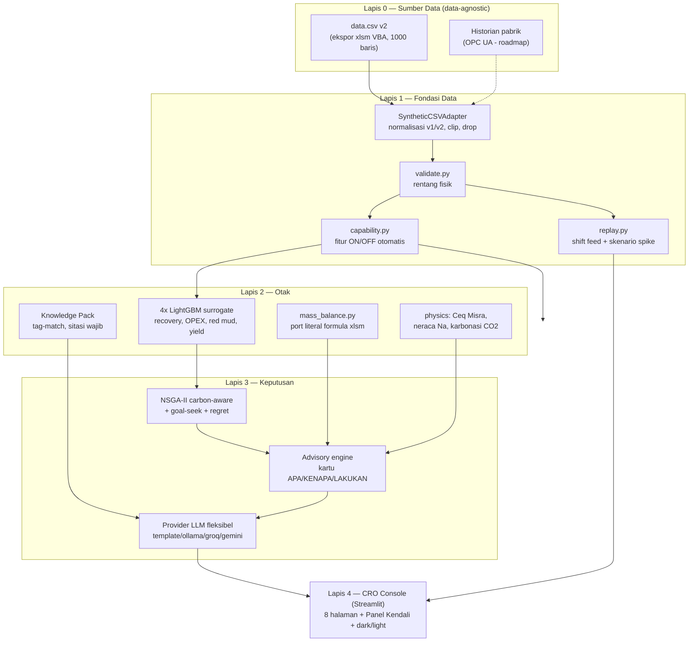
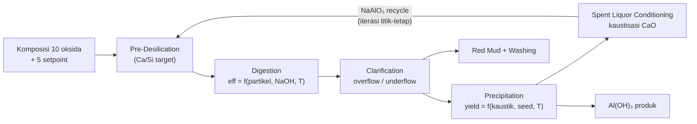
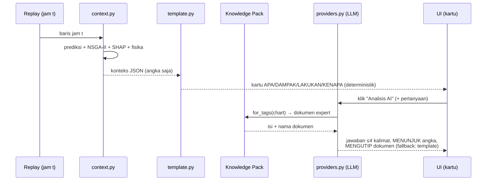
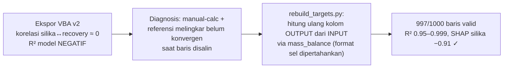

# 17 — Laporan Teknis OptiBayer

> ⚠️ **DOKUMEN INI MENDAHULUI PENSIUNNYA STREAMLIT.**
> Konsol Streamlit sudah dikeluarkan dari `main` — UI sekarang **Next.js + React**
> (`frontend/`) di atas REST API yang sama. Semua instruksi `streamlit run
> app/main.py` di bawah **tidak lagi berlaku di `main`**; ia tetap berjalan di
> branch arsip `feat/old-ada-streamlit`. Cara menjalankan & deploy yang berlaku
> sekarang ada di [README](../README.md).
> Isi dokumen ini sengaja dibiarkan utuh sebagai catatan sejarah keputusan tim.

> Dokumen konsolidasi untuk laporan/submission: metode & algoritma (dengan
> diagram Mermaid — dirender otomatis oleh GitHub), fitur, data, hasil, dan
> cara menjalankan. Rujukan detail: doc 06 (analisis), 09 (arsitektur),
> 13 (setup), 14 (batasan), 16 (deploy).

## 1. Ringkasan Sistem

**OptiBayer** — Bayer Process Advisor + konsol CRO untuk pabrik alumina:
*neuro-symbolic digital twin* yang menggabungkan tiga sumber kecerdasan —
**data historian** (ML surrogate), **hukum fisika** (neraca massa), dan
**pengalaman expert** (Knowledge Pack) — untuk memaksimalkan recovery Al,
meminimalkan OPEX (NaOH/CaO), meminimalkan red mud, plus mengkuantifikasi
CCUS karbonasi red mud (23 kg CO₂/ton, ScienceDirect 2026).

## 2. Arsitektur



Prinsip kunci (doc 09): **single source of schema** (`schema.py` satu-satunya
yang tahu kolom mentah), **adapter di pintu masuk**, **capability detection**
(fitur menyala/mati mengikuti data), **fisika terpisah dari ML**, **registry
model ber-metadata**, **advisory ber-fallback** (tidak pernah bergantung API).

## 3. Metode & Algoritma

### 3.1 Surrogate ML — LightGBM (gradient boosting)

- **Fitur (15):** 10 komposisi bauksit + 5 parameter proses. Kolom antara
  neraca massa DILARANG jadi fitur (anti data-leakage).
- **Target (4):** recovery (%), total OPEX (/jam), red mud (t/jam), yield
  presipitasi (%).
- **Validasi:** 5-fold cross-validation out-of-fold; `resid_std` CV dipakai
  deteksi anomali. Hyperparameter konservatif (pohon dangkal, subsample,
  L2) untuk ~1000 baris.
- **Kenapa GBM, bukan deep learning:** data tabular kecil — GBM tetap
  state-of-the-art, dapat diaudit SHAP, retraining detik-an di CPU (identik
  praktik soft-sensor industri). Lihat doc 06 §8.

### 3.2 Explainability — SHAP (TreeExplainer)

Global (validasi model belajar kimia yang benar: silika reaktif dominan,
korelasi −0.91) dan per-prediksi (bagian "kenapa" kartu advisory).

### 3.3 Optimasi multi-objektif — NSGA-II (pymoo), carbon-aware

```
min  F(x) = [ -recovery(x),  net_opex(x),  red_mud(x) ]
      net_opex = opex(x) − red_mud(x) × 0.023 tCO₂/t × harga_karbon
s.t.  x = 5 setpoint ∈ guardrail (irisan rentang data latih ∩ amplop aman)
```

Populasi 60 × 40 generasi ≈ 2.400 evaluasi surrogate (vektorized) < 2 detik.
Satu titik dipilih dari Pareto lewat bobot prioritas operator (slider
recovery/OPEX/ESG). **Goal-seek**: differential evolution (SciPy) dengan
penalti — "recovery ≥ X% termurah".

### 3.4 Regret Meter — counterfactual

Untuk tiap jam pada jendela 8 jam: cari setpoint terbaik via pencarian
kandidat tervektorisasi (256 sampel LHS-acak dalam guardrail, skor
`0.6·recovery_norm − 0.4·opex_norm`), bandingkan prediksi vs aktual →
"nilai yang tertinggal" (Δrecovery, ΔOPEX, Δred mud) + kurva
aktual-vs-counterfactual (area = regret).

### 3.5 Deteksi anomali — residual

`|aktual − prediksi| > 3 × resid_std(CV)` → kartu advisory "verifikasi
assay/instrumen". Sederhana, dapat dijelaskan, kalibrasinya dari CV.

### 3.6 Kalkulator neraca massa — port literal xlsm

`src/physics/mass_balance.py` = terjemahan sel-demi-sel workbook kalkulator
(8 sheet). Referensi melingkar spent-liquor diselesaikan **iterasi titik-tetap**
(~15–30 iterasi, <1 ms). Tervalidasi terhadap data: galat median <0,11%
per target. Feed rate & moisture (Dashboard!C6/C7) = parameter; seluruh
neraca linear terhadap dry feed (+ koreksi air make-up bila moisture ≠ 20%).



### 3.7 Fisika pendukung

- **Ceq presipitasi (Misra & Pearl 1981):**
  `log(Al₂O₃) = 6.2106 − 2486.7/T(K) + 1.0875·log₁₀(NaOH g/L)` — overlay
  gap supersaturasi (belum terkalibrasi pabrik; lihat doc 14 D1).
- **Neraca Na + kaustisasi:** dekomposisi kebocoran NaOH (DSP ≈ 0.85 kg/kg
  SiO₂ lolos pra-desilikasi; soda mati = fraksi karbonasi × (1−konversi);
  fisik = residual) + dosis CaO stoikiometrik `Na₂CO₃ + Ca(OH)₂ → 2NaOH + CaCO₃`.
- **Karbonasi CCUS:** 23 kg CO₂/t red mud, L/S 2:1, pH 11–13 → 8–9.5
  (Permen LHK 6/2021: 7–10); nilai karbon = CO₂ × harga (default pajak
  karbon RI Rp30rb/t, konfigurable).

### 3.8 Advisory & LLM grounding



Anti-halusinasi: LLM hanya menerima angka konteks chart tsb + knowledge
ber-tag; dilarang memakai angka luar; backend via env `LLM_PROVIDER`
(`template` default tanpa API, `ollama` lokal, `groq`/`gemini` free-tier).

### 3.9 Knowledge Pack (tier-1, tanpa vector DB)

Dokumen markdown ber-header `tags:`; pencocokan irisan tag → maks 3 dokumen
per kueri; registry `CHART_TAGS` memetakan chart↔tag (lentur — ubah tag =
ubah pemakaian). Jalur upgrade tier-2 (ribuan halaman/jurnal): embeddings +
FAISS/Chroma di balik kontrak `for_tags()` yang sama.

### 3.10 Perbaikan data v2 (insiden & solusi)



Ekspor asli diarsip (`data_v2_ekspor_asli.csv`); resep perbaikan macro
untuk re-export ada di doc 08.

## 4. Hasil Model (data v2, 997 baris, 5-fold CV)

| Target | R² | MAE |
|---|---|---|
| Recovery Al (%) | 0.987 | 0.32 |
| Total OPEX (/jam) | 0.945 | 518 |
| Red Mud (t/jam) | 0.991 | 5.98 |
| Yield Presipitasi (%) | 0.9995 | 0.046 |

Uji fisik: silika 2% → recovery optimal ~95%, silika 7% → ~85% (konsisten
kimia proses). Catatan jujur: R² tinggi karena data dari simulator — lihat
doc 14 A1.

## 5. Fitur per Halaman

| Halaman | Fitur utama |
|---|---|
| **Overview** | Tren + pita alarm + prediksi-vs-aktual + anomali; korelasi & scatter (trendline); Regret Meter + kurva counterfactual; laporan serah-terima shift (LLM/template); audit trail persisten (CSV) |
| **Diagram Proses** | Peta HMI live (pipa, readout digital, lampu status) + **3 lapisan analitik** (Operasi / Kebocoran NaOH / Jalur Karbon) + sparkline 12 jam + gauge |
| **Digesti** | Heatmap peta operasi (posisi ★ rekomendasi), radar setpoint, kurva Pareto (scatter + parallel coordinates ber-filter), what-if cepat feed jam-ini |
| **Liquor Loop** | Sankey NaOH (rumah tunggal) + dosis CaO stoikiometrik + konversi liter slurry |
| **Presipitasi** | Kurva Ceq + gap supersaturasi + rekomendasi suhu/seed |
| **Red Mud & CCUS** | Sankey aluminium + kalkulator karbonasi (CO₂, air, nilai Rp, status pH regulasi) |
| **Prediction Lab** | Komposisi bebas + feed rate/moisture; prediksi ML vs kalkulator fisika berdampingan; peringatan ekstrapolasi; sensitivitas + tornado; retrain dari UI |
| **Knowledge** | Dokumen expert ber-tag; search; upload/tulis-langsung; chips "dipakai oleh chart" |
| Lintas halaman | KPI stat-tile kontekstual, advisory kontekstual (penuh/ringkas/sembunyi), navigasi lompat (advisory→peta, jam→Lab), onboarding, tombol Bantuan, dark/light mode, tombol ✨ Analisis AI per chart |

## 6. Cara Menjalankan

```bash
pip install -r requirements.txt
python -m src.models.train --data data/raw/data.csv   # opsional (auto-train saat boot)
python -m streamlit run app/main.py                    # http://localhost:8501
```

Verifikasi: `tests/test_data.py` (M0) · `test_engine.py` (fisika+optimizer) ·
`test_advisory.py` (replay+advisory) · `test_app.py` (dashboard end-to-end) ·
`test_theme.py` (dark/light). LLM opsional: salin `.env.example` → `.env`
(semua backend gratis). Panduan lengkap + troubleshooting: doc 13.

### 6.1 Cara Deploy (ringkasan doc 16)

**A. Streamlit Community Cloud (gratis — juri dapat link):**
1. Push `main` ke GitHub → buka https://share.streamlit.io → *Sign in with
   GitHub* → **New app**.
2. Isi: repo `WwzFwz/antham-hackathon-nyukses` · branch `main` · main file
   **`app/main.py`** · Python **3.12**.
3. *Advanced → Secrets* (pengganti `.env`, format TOML):
   ```toml
   LLM_PROVIDER = "groq"
   GROQ_API_KEY = "gsk_xxx"
   ```
4. **Deploy** — boot pertama ±2–4 menit (install + auto-train model) →
   URL `https://<nama>.streamlit.app`. Update = `git push` (auto-rebuild).
5. Gotcha: app *tidur* bila lama tak dikunjungi → **buka URL 15 menit
   sebelum presentasi**; Ollama tidak jalan di cloud (pakai groq/gemini/
   template); RAM 1 GB (cukup).

**B. LAN venue (tanpa internet publik):**
`python -m streamlit run app/main.py --server.address 0.0.0.0` → bagikan
Network URL (`http://192.168.x.x:8501`) ke juri di Wi-Fi yang sama.

**C. Lokal (jaring pengaman):** `python -m streamlit run app/main.py` —
selalu siap walau cloud/Wi-Fi bermasalah.

## 7. Struktur Repo

```
app/        main.py (konsol) · ui.py (palet 2-mode, komponen) · views/ (8 halaman)
src/        schema · capability · data/ (adapter, validate, replay, rebuild_targets)
            models/ (train, registry, predict, explain) · physics/ (mass_balance,
            carbonation, precipitation, na_balance) · optimize/ (pareto, goal_seek,
            regret) · advisory/ (context, template, providers, knowledge)
knowledge/  dokumen expert ber-tag (mock, menunggu validasi ANTAM)
data/       raw (CSV v2 + arsip ekspor asli) · calculator (xlsm) · processed (log)
models/     artefak .joblib (gitignored) + metrics.json + *.meta.json
tests/      uji per milestone   docs/  01–17
```

## 8. Keamanan & Integrasi (ringkas)

Read-only terhadap pabrik, human-in-the-loop, guardrail amplop aman,
prompt LLM tanpa input bebas tak tervalidasi, data demo 100% sintetis.
Integrasi produksi (OPC UA → historian → OptiBayer, roadmap 3 fase
shadow→advisory→closed-loop): doc 07.
