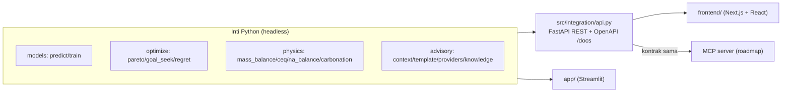

# 19 — Frontend Next.js + FastAPI (transformasi UI kedua)

> Streamlit TIDAK dihapus. Ini frontend KEDUA di atas inti headless yang sama,
> membuktikan arsitektur data-agnostic (doc 09): porting 9 halaman + fitur
> tanpa menyentuh satu baris pun logika Python.

## Kenapa dua frontend

| | Streamlit (`app/`) | Next.js + React (`frontend/`) |
|---|---|---|
| Kekuatan | iterasi tercepat, 1 proses, 1 bahasa | UI produksi: kontrol layout/animasi, scalable, embeddable |
| Model eksekusi | rerun seluruh script tiap interaksi | komponen + state, hanya yang berubah dirender |
| Untuk | membuktikan nilai (hackathon) | jalur produksi ANTAM (HMI/mobile/wall display) |
| Batas | kustomisasi UI mentok (CSS injection) | butuh backend terpisah + skill JS |

**Keputusan:** keduanya hidup berdampingan. Inti headless + REST/MCP contract
membuat "ganti UI" jadi urusan klien, bukan tulis ulang logika.

## Arsitektur

## REST API (`src/integration/api.py`)

FastAPI 0.139 (konflik starlette lama selesai; Streamlit tak terganggu).
Jalankan: `python -m uvicorn src.integration.api:app --port 8000` → `/docs`.
Model di-warm-up saat boot (predict ~6 ms, mass-balance ~3 ms).

**Endpoint kontrak** (dari `contract.ENDPOINTS`, satu sumber dgn playground &
MCP): `/v1/predict` · `/v1/mass-balance` · `/v1/optimize/pareto` ·
`/v1/optimize/goal-seek` · `/v1/knowledge` · `/v1/audit/decisions`.

**Endpoint frontend** (khusus UI React):
`/v1/replay/{s}` (deret tren) · `/v1/replay/{s}/hour/{h}` (KPI + kartu advisory
+ na/al/carbonation) · `/v1/operating-map` (heatmap + komposisi + bounds) ·
`/v1/pareto` · `/v1/ceq` · `/v1/correlation` (bar + scatter) · `/v1/regret`
(counterfactual + handover) · `/v1/sensitivity` (sweep + tornado + ekstrapolasi)
· `/v1/knowledge/add` · `/v1/explain` (Analisis AI per chart) ·
`/v1/integration/contract`.

Semua READ-ONLY terhadap pabrik (doc 07). CORS ke localhost:3000.

## Frontend (`frontend/`)

Next.js 16 (Turbopack) · React · Tailwind · Recharts · Zustand-style store
(`src/lib/store.tsx`) · tema dua-mode (`src/lib/theme.ts`).

- `components/Shell.tsx` — rail ikon kiri + Panel Kendali overlay + routing.
- `components/Advisory.tsx` — panel bisa DI-DRAG (dock atas↔kanan) + pagination.
- `components/HexRadar.tsx` — profil kesehatan pabrik (segi enam + grade).
- `components/Sankey.tsx` · `ParallelCoords.tsx` — chart SVG kustom (yang tak
  ada di Recharts).
- `components/ExplainAI.tsx` — Analisis AI per chart (reusable).
- `components/pages/*` — 9 halaman, setara penuh dgn Streamlit.

Charting: Recharts untuk line/bar/scatter/radar; SVG murni untuk Diagram HMI,
Sankey, parallel coordinates, heatmap (kontrol presisi + performa).

## Paritas fitur (0 fitur berkurang vs Streamlit)

Diverifikasi: `npx tsc --noEmit` bersih + `npm run build` sukses + semua
endpoint 200. Fitur yang sempat jadi gap lalu ditutup: Korelasi & Scatter,
Audit Trail, Sankey aluminium, what-if Digesti, sparkline Diagram, ekstrapolasi
+ sensitivitas + tornado di Lab, tambah dokumen Knowledge, chart CO₂ & Yield.

## Deploy

- **Streamlit**: doc 16 (Community Cloud).
- **Next.js + FastAPI**: butuh dua layanan — API (uvicorn di server Python /
  Railway / Render) + frontend (Vercel / Netlify / static export). Set
  `NEXT_PUBLIC_API_URL` ke URL API. Roadmap; untuk demo, jalankan lokal
  (2 terminal, lihat README §B).

## Catatan lingkungan

- Node.js ≥ 18 wajib untuk frontend. `frontend/AGENTS.md` mencatat Next.js
  versi ini punya breaking changes — baca `node_modules/next/dist/docs/` bila
  menyentuh API Next.js (routing/config), bukan sekadar styling.
- FastAPI 0.139 menggantikan pin 0.115 lama (yang bentrok starlette 1.3 dari
  Streamlit baru). Streamlit tetap jalan.
