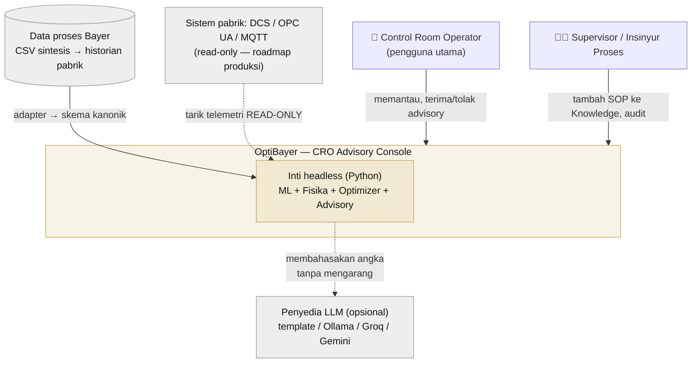
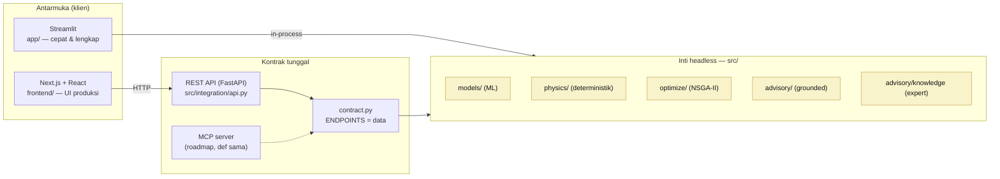
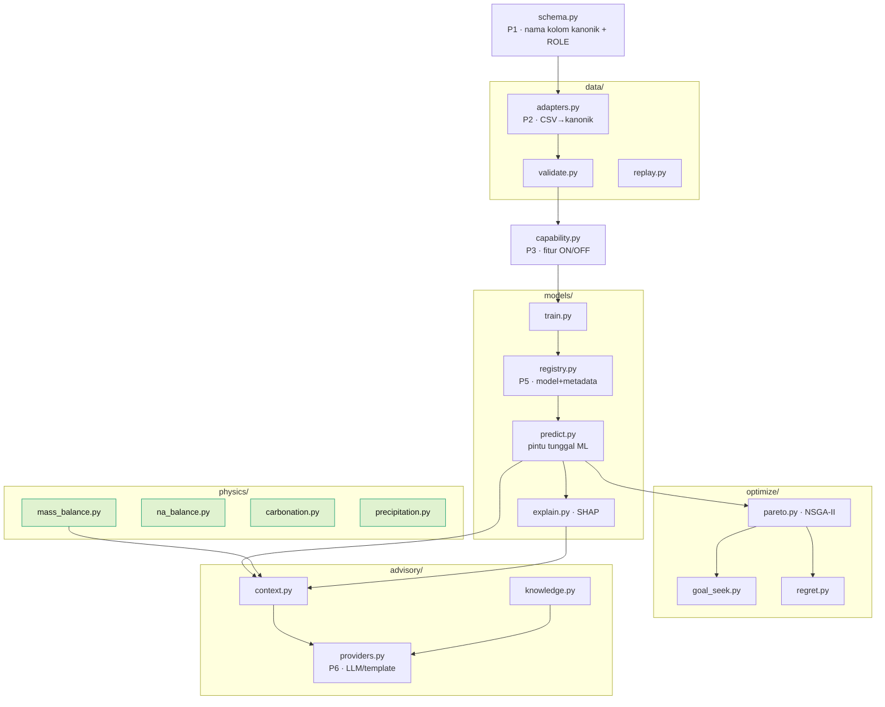
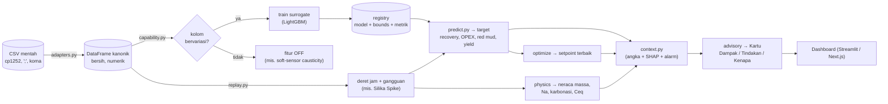
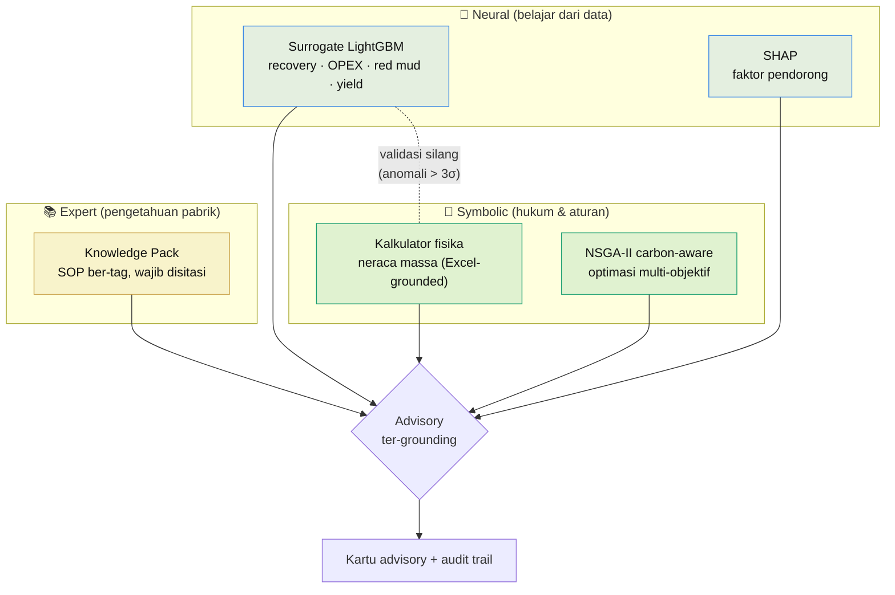
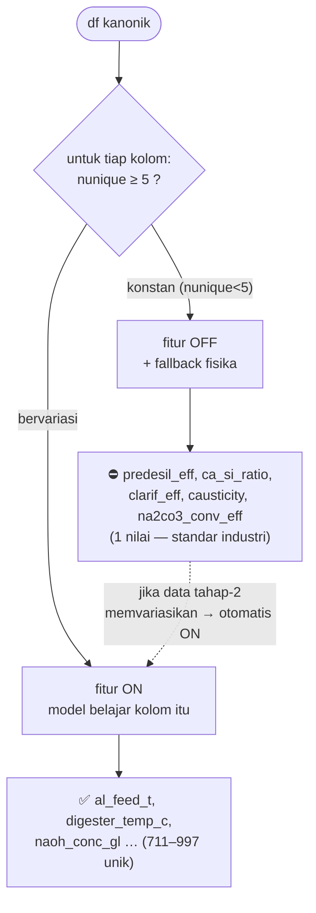
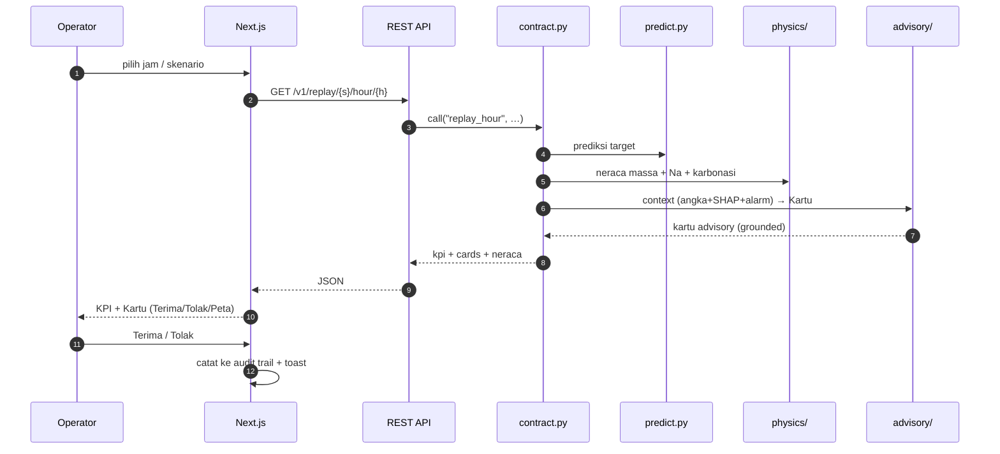
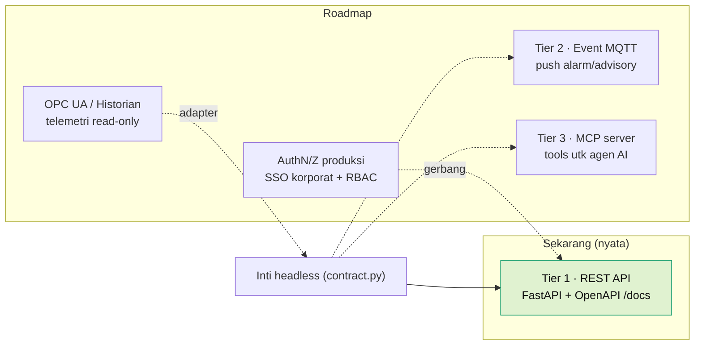

# 20 — Diagram Arsitektur (Visual)

> ⚠️ **DOKUMEN INI MENDAHULUI PENSIUNNYA STREAMLIT.**
> Konsol Streamlit sudah dikeluarkan dari `main` — UI sekarang **Next.js + React**
> (`frontend/`) di atas REST API yang sama. Semua instruksi `streamlit run
> app/main.py` di bawah **tidak lagi berlaku di `main`**; ia tetap berjalan di
> branch arsip `feat/old-ada-streamlit`. Cara menjalankan & deploy yang berlaku
> sekarang ada di [README](../README.md).
> Isi dokumen ini sengaja dibiarkan utuh sebagai catatan sejarah keputusan tim.

> Pelengkap visual untuk [09-arsitektur-v2.md](09-arsitektur-v2.md) (prinsip P1–P6
> & struktur kode) dan [07-integrasi-produksi.md](07-integrasi-produksi.md) (tier
> integrasi). Dokumen ini **tidak menambah klaim baru** — hanya menggambarkan
> yang sudah ada di kode agar cepat dipahami. Semua diagram Mermaid: render di
> GitHub, VS Code (ekstensi Markdown Preview Mermaid), dan Obsidian tanpa alat
> eksternal.

Daftar diagram:
1. [Konteks sistem (siapa memakai apa)](#1-konteks-sistem)
2. [Arsitektur headless — satu otak, dua wajah](#2-arsitektur-headless)
3. [Struktur modul inti Python](#3-struktur-modul-inti)
4. [Alur data: mentah → prediksi → advisory](#4-alur-data)
5. [Neuro-symbolic: ML + fisika + optimizer + expert](#5-neuro-symbolic)
6. [Capability detection (fitur nyala/mati)](#6-capability-detection)
7. [Sequence: satu siklus advisory](#7-sequence-advisory)
8. [Roadmap integrasi produksi (3 tier)](#8-roadmap-integrasi)

---

## 1. Konteks sistem

Siapa dan sistem luar apa yang berinteraksi dengan OptiBayer (C4 — level Context).



**Poin keamanan (doc 07):** panah ke DCS **read-only** — dashboard tak pernah
menulis perintah ke aktuator pabrik. LLM hanya *membahasakan* angka yang sudah
dihitung; tidak menjadi sumber angka.

---

## 2. Arsitektur headless

Satu inti Python dipakai oleh **dua frontend** lewat kontrak yang sama —
bukti desain data-agnostic (P1–P6 doc 09).



> **Kenapa ini nilai jual:** menambah/ mengganti frontend (atau menambah MCP
> untuk agen AI) **tidak menyentuh logika** — semua lewat `contract.py` yang
> mendefinisikan endpoint sebagai *data*, bukan kode ter-duplikasi.

---

## 3. Struktur modul inti

Tiap paket punya satu tanggung jawab; panah = arah ketergantungan.



Fisika (hijau) **tidak bergantung** pada ML — deterministik & unit-testable
(P4). Inilah "symbolic" pada neuro-symbolic.

---

## 4. Alur data

Dari file mentah sampai kartu advisory di layar.



---

## 5. Neuro-symbolic

Tiga sumber kecerdasan yang saling menjaga — bukan black-box tunggal.



**Jaring pengaman:** saat input di luar rentang latih (ekstrapolasi), UI menandai
prediksi ML kurang tepercaya sementara **kalkulator fisika tetap berlaku penuh**
(deterministik). ML dan fisika saling cek — anomali > 3σ residual → peringatan.

---

## 6. Capability detection

Fitur menyala/mati **otomatis** dari data — inti prinsip P3 (`capability.py`).



Kolom konstan = **standar industri Bayer** (Ca/Si 1.2, causticity 0.85, dst),
divalidasi jalur fisika. Bukan bug — desain jujur: fitur baru menyala sendiri
begitu data mendukung. Detail: [14-batasan.md](14-batasan.md).

---

## 7. Sequence advisory

Satu siklus dari "operator buka jam-N" sampai kartu muncul (jalur Next.js).



Jika `LLM_PROVIDER` diset (ollama/groq/gemini), langkah `context → Kartu`
memakai LLM untuk **membahasakan** angka; gagal apa pun → jatuh ke template
deterministik (P6). Default: template, offline, tanpa token.

---

## 8. Roadmap integrasi

Tier integrasi produksi (doc 07). Yang tebal = **sudah ada**; putus-putus =
roadmap.



Ketiga tier berbagi **definisi endpoint yang sama** (`contract.py`) — menambah
MQTT/MCP = iterasi daftar yang sudah ada, bukan tulis ulang. Auth: lihat catatan
di [07-integrasi-produksi.md](07-integrasi-produksi.md) (produksi: SSO + RBAC per
peran CRO/Supervisor/Admin).

---

### Cara render diagram

- **GitHub / GitLab** — otomatis (blok ```mermaid```).
- **VS Code** — ekstensi *Markdown Preview Mermaid Support*, lalu `Ctrl+Shift+V`.
- **Ekspor gambar** — [mermaid.live](https://mermaid.live) (tempel kode blok) →
  unduh SVG/PNG untuk slide presentasi.
